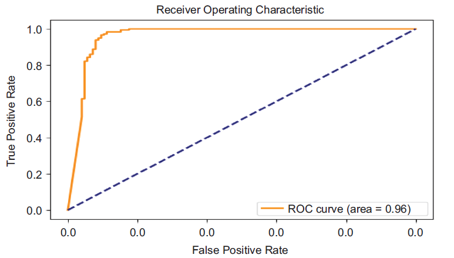
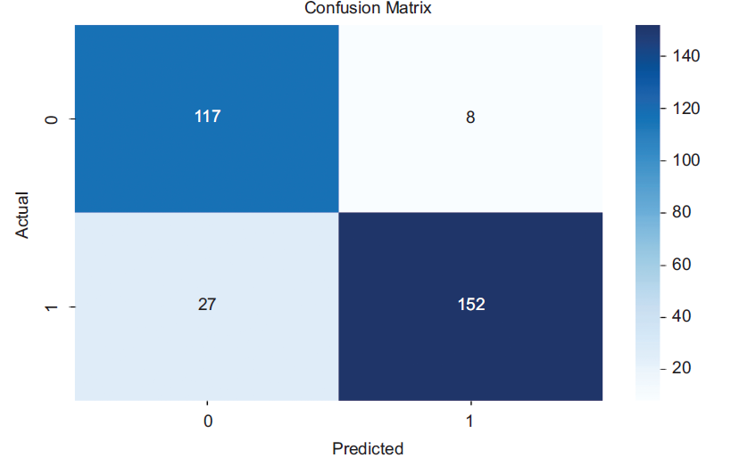

# Brain Tumor Detection — GAN + ResNet50


A deep learning pipeline for binary brain tumor classification from MRI scans, combining **Generative Adversarial Networks (GAN)** for data augmentation with a **ResNet50** transfer learning classifier.

This project is an implementation based on the research published in:

> Khekare, G., Gupta, S.K., & Pandya, S. (2025). *Harnessing Generative AI for Enhanced Brain Tumor Detection in Clinical Trials.* In **Generative AI Unleashed**, IET, Chapter 6. https://doi.org/10.1049/PBPC076E_ch6

---

## Overview

Brain tumor detection from MRI scans is a critical clinical task where dataset size is a constant bottleneck. This project addresses class imbalance and data scarcity using a GAN-based augmentation strategy, feeding synthetic MRI images alongside real ones into a frozen ResNet50 backbone for binary classification (Tumor / No Tumor).

---

## Architecture

```
Brain MRI Dataset (253 images)
         │
         ▼
  Data Augmentation
  (flips → 1,000 images/class)
         │
    ┌────┴────┐
    │         │
    ▼         ▼
GAN Training  Real Images
(200 epochs)  (normalised)
    │         │
    ▼         │
Generator     │
Conv2DTranspose ×3│
tanh output   │
    │         │
    ▼         ▼
Synthetic   Train Split
MRI Scans   (70%)
    │         │
    └────┬────┘
         │
         ▼
  Combined Training Set
  (Real + GAN-augmented)
         │
         ▼
  ResNet50 (frozen, ImageNet)
         │
    Flatten
         │
    Dense(1024) + Dropout(0.4)
         │
    Dense(1, sigmoid)
         │
         ▼
  Tumor / No Tumor
```

### GAN Architecture

| Component | Details |
|-----------|---------|
| Input | Latent vector (dim=100) |
| Generator | Dense → Reshape → Conv2DTranspose ×3 → tanh |
| Discriminator | Conv2D ×2 + LeakyReLU(0.2) + Dropout → Dense(1, sigmoid) |
| Output size | 32×32 grayscale images |
| Training | 200 epochs, label smoothing 0.9, Adam (lr=0.0002) |

### Classifier Architecture

| Component | Details |
|-----------|---------|
| Backbone | ResNet50 (frozen, ImageNet weights) |
| Input size | 256×256×3 |
| Head | Flatten → Dense(1024, ReLU) → Dropout(0.4) → Dense(1, sigmoid) |
| Training | 10 epochs, Adam, binary cross-entropy |
| Train/Test split | 70% / 30% |

---

## Results

### Metrics

| Metric | Value |
|--------|-------|
| Accuracy | **98.87%** |
| Precision | 93.74% |
| Recall | 92.14% |
| F1 Score | 92.93% |
| AUC-ROC | 0.96 |

### Model Comparison

| Model | Precision (%) | Recall (%) | F1 Score (%) | Accuracy (%) |
|-------|--------------|-----------|-------------|-------------|
| GoogleNet | 60.29 | 70.39 | 64.95 | 55.26 |
| VGG16 | 72.41 | 93.85 | 81.75 | 75.33 |
| DenseNet | 58.80 | 100.00 | 74.10 | 58.80 |
| Custom CNN | 90.00 | 95.50 | 92.60 | 91.00 |
| **GAN + ResNet50 (Ours)** | **93.74** | **92.14** | **92.93** | **98.87** |

### Plots

| Training History | ROC Curve |
|:---:|:---:|
|  |  |

| Confusion Matrix | Model Comparison |
|:---:|:---:|
|  |  |

---

## Dataset

[Kaggle — Brain MRI Images for Brain Tumor Detection](https://www.kaggle.com/datasets/navoneel/brain-mri-images-for-brain-tumor-detection)

| Split | Normal | Tumor |
|-------|--------|-------|
| Raw | 98 | 155 |
| After augmentation | 1,000 | 1,000 |
| Train | — | 708 total |
| Test | — | 304 total |

> Dataset not included in this repository. Download and place images in `data/yes/` and `data/no/`.

---

## Project Structure

```
brain-tumor-gan-resnet/
├── app/
│   └── app.py              # Gradio inference app
├── assets/                 # Result plots for README
│   ├── confusion_matrix.png
│   ├── model_comparison.png
│   ├── roc_curve.png
│   └── training_history.png
├── data/
│   ├── yes/                # Tumor MRI images (not included)
│   ├── no/                 # Normal MRI images (not included)
│   └── README.md
├── notebooks/
│   └── brain_tumor_detection.ipynb
├── outputs/
│   ├── models/             # Saved .keras models (not included)
│   └── plots/              # Generated evaluation plots
├── src/
│   ├── config.py           # Hyperparameters and paths
│   ├── data_loader.py      # Image loading and augmentation
│   ├── gan.py              # Generator, discriminator, training loop
│   ├── classifier.py       # ResNet50 classifier head
│   ├── train.py            # End-to-end training pipeline
│   └── evaluate.py         # Metrics, plots, reports
├── requirements.txt
├── LICENSE
└── README.md
```

> Source code is intentionally omitted from this repository. The architecture, methodology, and results are documented here for portfolio and research reference.

---

## Setup

```bash
git clone https://github.com/KRYSTALM7/brain-tumor-gan-resnet.git
cd brain-tumor-gan-resnet

python -m venv venv
venv\Scripts\activate        # Windows
# source venv/bin/activate   # macOS/Linux

pip install -r requirements.txt
```

### Requirements

```
tensorflow==2.15.0
opencv-python==4.9.0.80
scikit-learn==1.4.0
matplotlib==3.8.2
seaborn==0.13.2
numpy==1.26.4
gradio==3.50.2
Pillow==10.2.0
```

---

## Citation

If you use this work or reference the underlying research, please cite:

```bibtex
@incollection{kumar2025brain,
  author    = {Kumar, MV Sujan and Khekare, Ganesh and Gupta, Shashi Kant and Pandya, Sharnil},
  title     = {Harnessing Generative {AI} for Enhanced Brain Tumor Detection in Clinical Trials},
  booktitle = {Generative {AI} Unleashed},
  publisher = {Institution of Engineering and Technology ({IET})},
  year      = {2025},
  chapter   = {6},
  doi       = {10.1049/PBPC076E_ch6},
  url       = {https://doi.org/10.1049/PBPC076E_ch6}
}
```

---

## License

This repository is licensed under the [MIT License](LICENSE).

The implementation is based on published research. All academic credit belongs to the original authors cited above.